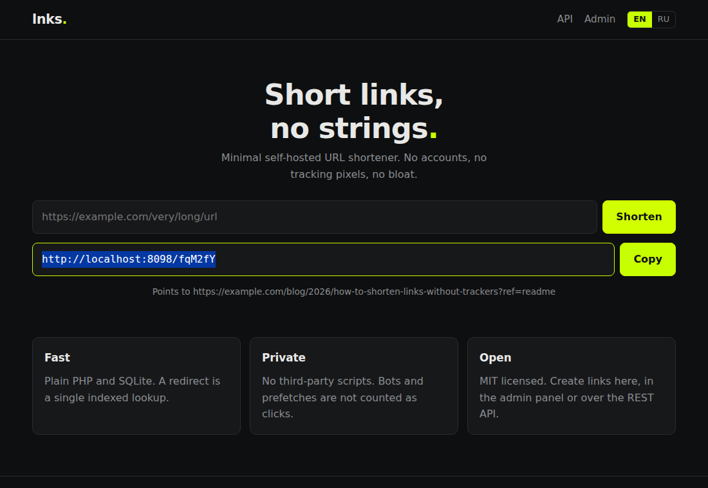
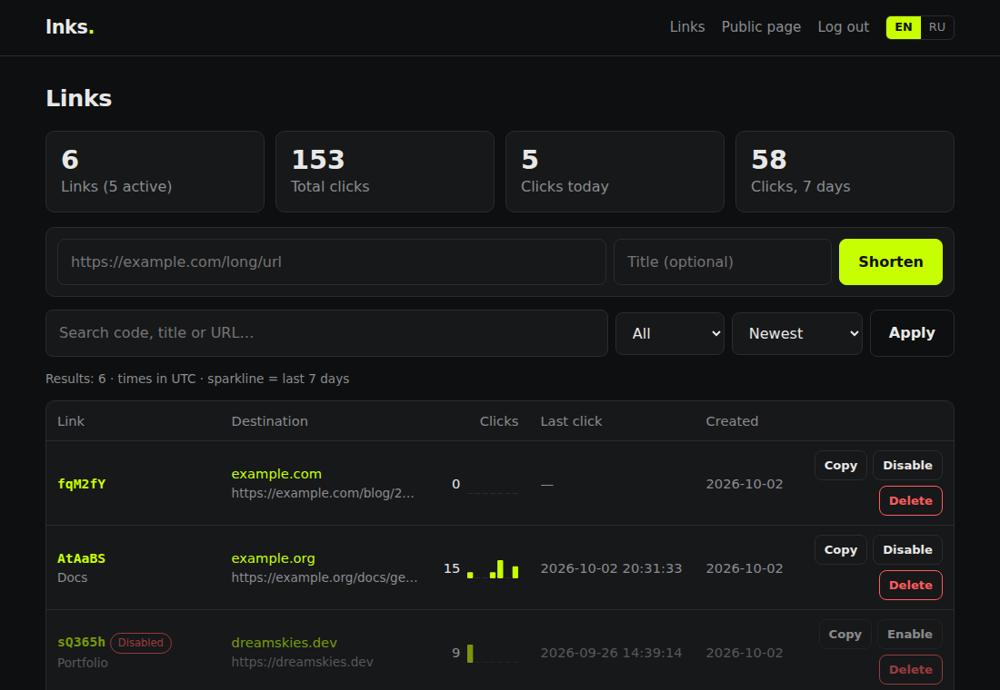
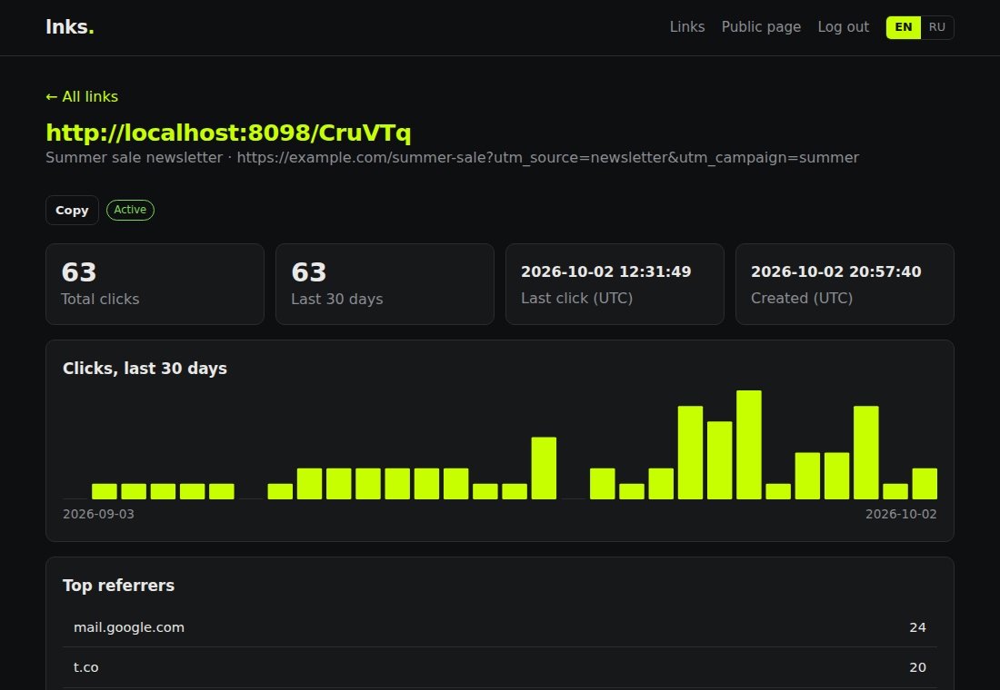
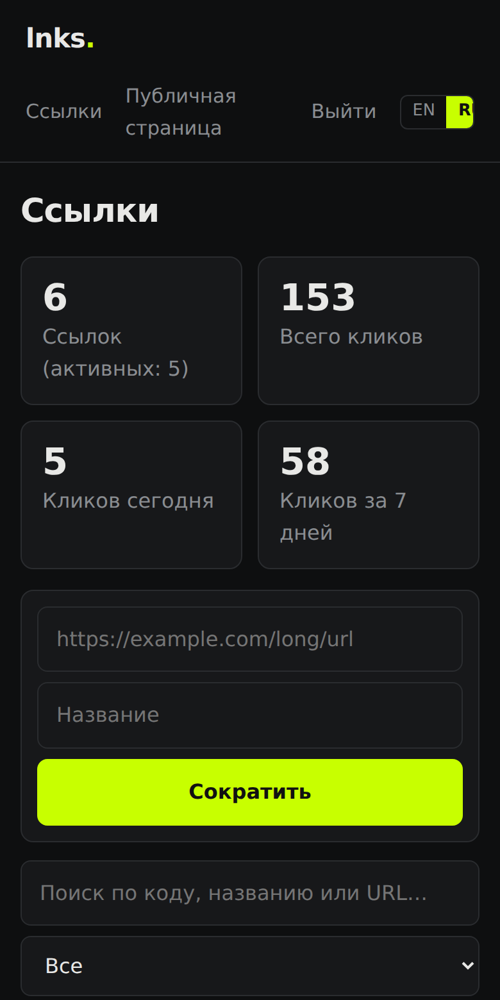

[](LICENSE)


**English** · [Русский](README.ru.md)

# lnks

Minimal self-hosted URL shortener. One small PHP app, SQLite, zero dependencies.

No Composer, no framework, no Docker, no tracking pixels, no third-party scripts. Upload to any PHP hosting, open it in a browser, and it works.

<p align="center">
  
  
</p>
<p align="center">
  
  
</p>

## Features

**Shortening**
- Create links from the public form, the admin panel or the REST API
- Optional title for every link
- Public mode (anyone can shorten, per-IP rate limit) or private mode (admin + API only)
- Links pointing back to the shortener itself are rejected (no redirect loops)

**Admin panel**
- Login + password (you choose both in the installer), brute-force lockout
- Dashboard: total links, total clicks, clicks today and over 7 days
- Search by code, title or URL; filter by status; sort by date, clicks or last click
- Per-link 7-day sparkline and a statistics page (30-day chart, top referrers)
- Enable / disable / delete, one-click copy, pagination

**Clicks**
- Per-link counters with a click log (timestamp + referrer, no IPs, no cookies)
- Bots, crawlers, link previews, `HEAD` requests and browser prefetches are **not** counted

**Interface**
- **EN / RU language switcher** (remembered in a cookie, defaults to the browser language)
- Responsive layout, automatic light / dark theme, no JavaScript frameworks

**API**
- Bearer-token REST API: create, list, details with daily clicks, enable / disable, delete

**Operations**
- Web installer with environment checks, locks itself after install
- Automatic database migrations on upgrade
- Strict Content-Security-Policy, CSRF protection, prepared statements everywhere

## Requirements

- PHP 8.0+ with `pdo_sqlite` (present in every default PHP build)
- Apache with `mod_rewrite`, or Nginx (config below)

## Installation

**Web installer (easiest):** upload the files, point your domain's document root at the project directory and open the site. The setup wizard runs automatically:

1. pick an **admin username and password**,
2. choose whether anyone may shorten links from the homepage,
3. copy the generated API token (shown once; it is also stored in `config.php`).

The installer locks itself once `config.php` exists. You may delete `install.php` afterwards.

**Manual:**

```bash
git clone https://github.com/iDreamSkies/lnks.git
cd lnks
cp config.example.php config.php
```

Edit `config.php`:

```bash
# Generate the admin password hash (put it into admin_pass_hash)
php -r "echo password_hash('your-password', PASSWORD_BCRYPT), PHP_EOL;"

# Generate the API token (put it into api_token)
php -r "echo bin2hex(random_bytes(24)), PHP_EOL;"
```

Set `admin_user` to the login you want (default `admin`), then make sure `storage/` is writable by the web server:

```bash
chmod 775 storage
```

**Local dev:** `php -S localhost:8080 router.php`

### Upgrading

Pull the new files and keep your `config.php` and `storage/`. The database is migrated automatically on the first request. Configs from older versions keep working: a missing `admin_user` defaults to `admin`.

### Nginx

```nginx
server {
    listen 80;
    server_name lnks.example.com;
    root /var/www/lnks;
    index index.php;

    location /storage/ { deny all; }
    location /lang/    { deny all; }
    location ~ ^/(config|bootstrap|layout|i18n|router|schema|\.git) { deny all; }

    location / {
        try_files $uri /index.php$is_args$args;
    }

    location ~ \.php$ {
        include fastcgi_params;
        fastcgi_param SCRIPT_FILENAME $document_root$fastcgi_script_name;
        fastcgi_pass unix:/run/php/php8.3-fpm.sock;
    }
}
```

## Language

The interface is available in English and Russian. Visitors switch with the **EN | RU** toggle in the header; the choice is saved in a cookie. Without a choice, the browser language is used (falls back to English). To force a default for everyone, set `'lang' => 'en'` or `'ru'` in `config.php`.

Want another language? Copy `lang/en.php` to `lang/xx.php`, translate the values and add the code to `LNKS_LANGS` in `i18n.php`.

API responses are always in English.

## API

All requests need `Authorization: Bearer YOUR_API_TOKEN`.

```bash
# Create (title is optional)
curl -X POST https://lnks.example.com/api.php \
  -H "Authorization: Bearer YOUR_API_TOKEN" -H "Content-Type: application/json" \
  -d '{"url": "https://example.com/very/long/url", "title": "Docs"}'

# List (q, limit 1-100, offset)
curl "https://lnks.example.com/api.php?q=docs&limit=20" -H "Authorization: Bearer YOUR_API_TOKEN"

# Details + clicks for the last 30 days
curl "https://lnks.example.com/api.php?code=aB3xYz" -H "Authorization: Bearer YOUR_API_TOKEN"

# Disable (0) / enable (1)
curl -X PATCH "https://lnks.example.com/api.php?code=aB3xYz" -H "Authorization: Bearer YOUR_API_TOKEN" \
  -H "Content-Type: application/json" -d '{"status": 0}'

# Delete
curl -X DELETE "https://lnks.example.com/api.php?code=aB3xYz" -H "Authorization: Bearer YOUR_API_TOKEN"
```

Create response (201):

```json
{ "ok": true, "id": 1, "code": "aB3xYz", "short_url": "https://lnks.example.com/aB3xYz", "url": "https://example.com/very/long/url", "title": "Docs" }
```

Errors return `{ "ok": false, "error": "..." }` with an appropriate HTTP status (400, 401, 404, 405, 422, 503).

## Configuration

| Key | Description |
|---|---|
| `base_url` | Public URL of the instance; empty = auto-detect from the request |
| `lang` | `auto` (browser language), `en` or `ru` — default language |
| `admin_user` | Admin login (default `admin`) |
| `admin_pass_hash` | bcrypt hash of the admin password |
| `api_token` | Bearer token for `/api.php`; empty = API disabled |
| `public_form` | `true` — anyone can shorten from the homepage; `false` — admin/API only |
| `rate_limit` | `['max' => 20, 'window_min' => 60]` — public form limit per IP |
| `trust_proxy` | `true` to read the client IP from `X-Forwarded-For` (only behind your own reverse proxy) |
| `code.length` | Short code length (default 6, clamped to 4–12) |
| `timezone` | PHP timezone (the UI shows times in UTC) |

## Security notes

- CSRF protection on all forms; logout is a POST
- Prepared statements everywhere; user input is always escaped on output
- Login requires username **and** password; 5 failed attempts per 15 minutes lock the IP out; session ID regenerated on login; `HttpOnly` + `SameSite` cookies
- Strict Content-Security-Policy (no inline scripts or styles), `X-Frame-Options: DENY`, `nosniff`
- `storage/`, `lang/`, config and internal files are blocked at the web-server level
- Redirects send `X-Robots-Tag: noindex`
- No cookies for visitors who only follow short links

## Project layout

```
index.php      homepage + redirects        admin.php   admin panel
api.php        REST API                    install.php web installer
bootstrap.php  config, DB, helpers         layout.php  page layout, support links
i18n.php       translations loader         lang/       en.php, ru.php
schema.sql     database schema             public/     styles.css, app.js
```

## Need more?

lnks is the intentionally minimal open-source core. A full-featured edition exists with:

- Custom slugs and link editing
- Multi-domain support
- Link expiration, click limits, password-protected links
- UTM builder and per-click analytics (geo, device, browser, unique visitors)
- A/B split testing
- Telegram bot integration
- Multi-user access with roles
- Import/export

Interested in the full edition, a hosted instance, or custom development?
Reach out: [dreamskies.dev](https://dreamskies.dev) · Telegram [@dreamskies](https://t.me/dreamskies)

## Support the project

lnks is free and MIT licensed. If it saves you time, you can support its development:

- Crypto: [pay.oxapay.com](https://pay.oxapay.com/14606636/)
- From Russia: [YooMoney](https://yoomoney.ru/fundraise/1KGTK8NPPQN.260925)

Bugs and ideas: [open an issue](https://github.com/iDreamSkies/lnks/issues).

## License

MIT — see [LICENSE](LICENSE).

---

Built by [DreamSkies](https://dreamskies.dev)
