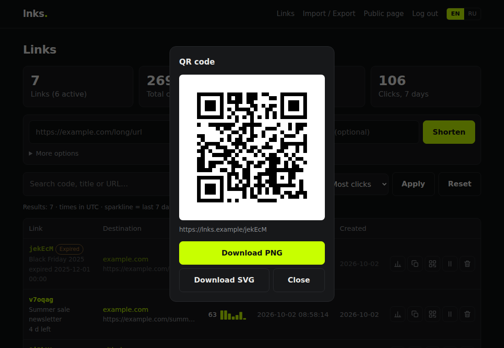
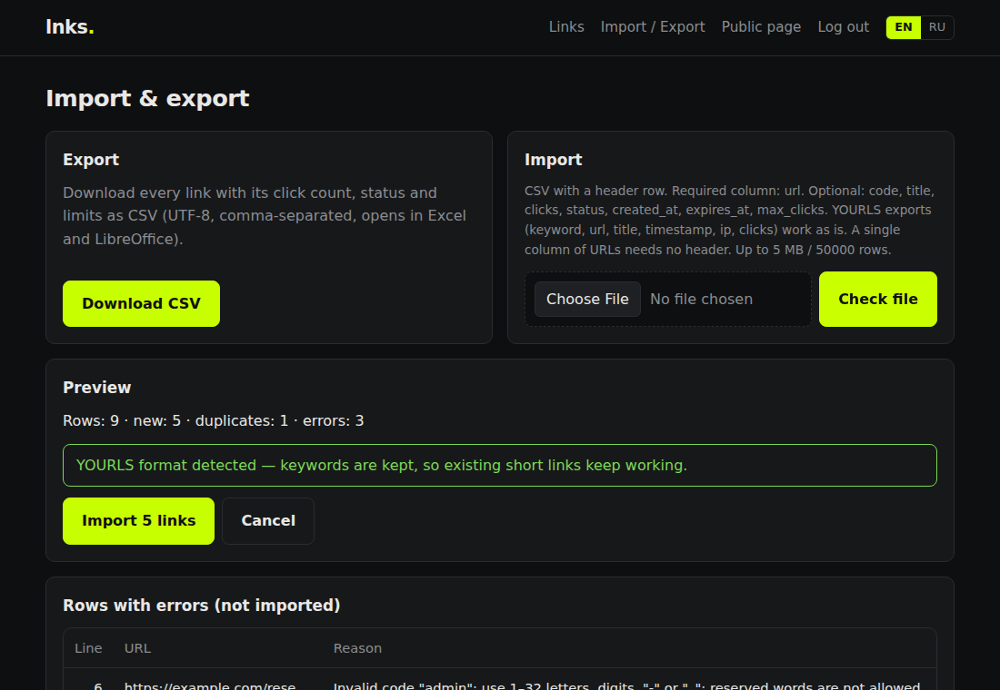

[](LICENSE)


[](https://github.com/iDreamSkies/lnks/actions/workflows/tests.yml)

[English](README.md) · **Русский** · [Сайт проекта](https://idreamskies.github.io/lnks/ru/)

# lnks

Минималистичный self-hosted сервис сокращения ссылок. Одно небольшое PHP-приложение, SQLite, ноль зависимостей.

> ### Работает без SSH и MySQL
> Залейте файлы по **FTP**, откройте домен в браузере, задайте логин и пароль — готово.
> Не нужен доступ к консоли, не нужно создавать базу данных, никаких Composer, Docker и Node.js.
> Если хостинг поддерживает PHP 8.0+ (а это почти любой виртуальный хостинг), lnks на нём заработает.

Никаких трекинг-пикселей, сторонних скриптов и внешних сервисов: QR-коды рисуются в браузере, статистика хранится в вашем файле SQLite.

<p align="center">
  
  
</p>
<p align="center">
  
  
</p>
<p align="center">
  
  
</p>

## Сравнение

| | **lnks** | YOURLS | Shlink | Kutt |
|---|---|---|---|---|
| Среда | PHP 8.0+ | PHP 8.1+ | PHP 8.4+ | Node.js 20+ |
| База данных | SQLite, создаётся сама | MySQL / MariaDB (создать вручную) | MySQL, MariaDB, PostgreSQL, SQL Server или SQLite | SQLite, PostgreSQL или MySQL / MariaDB |
| Нужные расширения PHP | `pdo_sqlite` | `pdo_mysql` | `curl`, `intl`, `gd`, `gmp`/`bcmath`, драйвер PDO | — |
| Установка только по FTP (без SSH) | ✅ веб-установщик | ✅ правка `config.php`, затем `/admin` | ❌ CLI-установщик запускается на сервере | ❌ нужен процесс Node.js или Docker |
| Обычный виртуальный PHP-хостинг | ✅ | ✅ (с MySQL) | редко | ❌ |
| Встроенная админка | ✅ | ✅ | отдельное приложение (Shlink Web Client) | ✅ |
| QR-коды | ✅ | плагин | в веб-клиенте | ✅ |
| Срок действия / лимит кликов | ✅ / ✅ | плагины | ✅ / ✅ | ✅ / — |
| Импорт CSV (в т. ч. из YOURLS) | ✅ в админке и API | плагин | ✅ CLI-импортёр | — |

<sub>Сверено с репозиториями и README проектов в октябре 2026 (YOURLS 1.10, Shlink 5, Kutt 3). Нашли неточность? [Создайте issue](https://github.com/iDreamSkies/lnks/issues).</sub>

**Выбирайте lnks**, если нужен сокращатель на недорогом виртуальном хостинге за минуту, без сервера БД и консоли. **YOURLS** — если нужна его экосистема плагинов и уже есть MySQL, **Shlink** — для нескольких доменов и отдельного API-бэкенда, **Kutt** — если у вас и так Node.js или Docker.

## Возможности

**Сокращение**
- Создание ссылок через публичную форму, админку или REST API
- Необязательное название для каждой ссылки
- Публичный режим (сокращать может любой, лимит по IP) или закрытый (только админ и API)
- Ссылки на сам сервис отклоняются (нет петель редиректа)
- **Срок действия и лимит переходов** для ссылки: после них ссылка отвечает `410 Gone` со страницей-заглушкой; лимит соблюдается атомарно даже при одновременных кликах

**Админка**
- Вход по логину и паролю (оба задаются в установщике), защита от подбора
- Сводка: ссылки, клики всего, сегодня и за 7 дней
- Поиск по коду, названию и URL; фильтр по статусу (активные / истёкшие / отключённые); сортировка по дате, кликам и последнему клику
- **Массовые действия**: отметьте несколько ссылок (или все на странице) и включите, выключите, добавьте / снимите теги или удалите их разом
- **Теги**: через запятую при создании или в настройках ссылки, чипы `#тег` в списке, фильтр по тегу
- В списке видно, сколько осталось времени и «12 из 100 переходов»; название, срок и лимит меняются на странице ссылки
- Мини-график за 7 дней у каждой ссылки и страница статистики: периоды 7 / 30 / 90 дней со сравнением с предыдущим периодом, клики по дням и по часам, источники, устройства, браузеры, операционные системы и (по желанию) страны
- Включение, отключение, удаление, копирование в один клик, пагинация
- **Ссылки под паролем**: перед редиректом посетитель вводит пароль; адрес назначения до этого не раскрывается, перебор ограничен по ссылке и IP
- **Свои короткие имена** (`/spring-sale`) и **несколько доменов**: перечислите дополнительные хосты в `config.php` и привяжите ссылку к одному из них — или оставьте её работать на всех
- **UTM-метки и шаблоны**: добавляйте `utm_source` / `utm_medium` / `utm_campaign` при создании ссылки или выбирайте сохранённый шаблон (Админка → UTM-шаблоны); остальные параметры запроса и `#якорь` сохраняются как есть
- **Импорт и экспорт CSV** с предпросмотром, поиском дубликатов и отчётом об ошибках; **выгрузка YOURLS импортируется как есть** (ключи продолжают работать)
- **QR-код** для каждой ссылки: предпросмотр и скачивание PNG/SVG (генерируется в браузере, без внешних сервисов)

**Клики**
- Счётчики по ссылкам и журнал кликов: время, referrer, семейство браузера / ОС / устройства (разбирается на сервере), страна по желанию — **IP-адреса и cookie не сохраняются**
- Боты, краулеры, превью ссылок, `HEAD`-запросы и предзагрузка браузера **не** считаются

**Интерфейс**
- **Переключатель языка RU / EN** (запоминается в cookie, по умолчанию — язык браузера)
- Адаптивная вёрстка, автоматическая светлая и тёмная тема, никаких JS-фреймворков

**API**
- REST API с Bearer-токеном: создание, список, детали с кликами по дням, включение и отключение, удаление

**Эксплуатация**
- Веб-установщик с проверкой окружения, блокируется после установки
- Автоматические миграции базы при обновлении
- Строгая Content-Security-Policy, CSRF-защита, подготовленные запросы везде

## Требования

- PHP 8.0 или новее с `pdo_sqlite` (включено практически на любом хостинге; установщик это проверит)
- Apache с `mod_rewrite` (стандарт на виртуальном хостинге) или Nginx (конфиг ниже)
- lnks должен находиться в **корне домена или поддомена** (`https://s.example.com/`), а не в подпапке

## Установка

### Установка по FTP (виртуальный хостинг, без SSH)

1. **Скачайте** lnks: на GitHub нажмите **Code → Download ZIP** и распакуйте архив на компьютере.
2. **Создайте домен или поддомен** в панели хостинга (cPanel, ISPmanager, Plesk, DirectAdmin…), например `s.example.com`, и выберите для него **PHP 8.0 или новее**.
3. **Загрузите файлы** FTP-клиентом (FileZilla, WinSCP или файловый менеджер хостинга) в папку этого домена — обычно `public_html`, `www` или `s.example.com/`. Загружайте *содержимое* папки `lnks-main`, включая скрытый файл `.htaccess` (в FileZilla: *Сервер → Принудительно показывать скрытые файлы*).
4. **Дайте права на запись в `storage/`**: правый клик по папке `storage` → *Права доступа к файлу* → `775` (или `777`, если хостинг этого требует). Корневая папка тоже должна быть доступна для записи — один раз, чтобы установщик создал `config.php`.
5. **Откройте домен** в браузере. Мастер установки проверит PHP, SQLite и права, затем попросит задать **логин и пароль администратора**.
6. **Сохраните API-токен**, показанный в конце. По желанию удалите `install.php` по FTP.

Админка находится по адресу `https://ваш-домен/admin.php`. Включите HTTPS в панели хостинга (почти везде есть бесплатные сертификаты Let's Encrypt).

<details>
<summary>Если что-то не работает</summary>

- **Ошибка 500 или все короткие ссылки дают 404** — не загружен `.htaccess` или выключен `mod_rewrite`. Загрузите `.htaccess` заново; на хостинге только с Nginx используйте конфиг ниже или попросите поддержку направить все запросы на `index.php`.
- **В установщике красным «storage/ доступна для записи»** — выставьте папке `storage` права `775`, а на хостингах, где PHP работает от другого пользователя, — `777`.
- **Красным «PDO SQLite»** — включите расширение `pdo_sqlite` (иногда называется `sqlite3`) в настройках PHP в панели хостинга.
- **Нет стилей, страница «голая»** — lnks загружен в подпапку; перенесите его в корень домена или поддомена.

</details>

### Установка через консоль (VPS, ручная настройка)

```bash
git clone https://github.com/iDreamSkies/lnks.git
cd lnks
cp config.example.php config.php
```

Отредактируйте `config.php`:

```bash
# Хеш пароля администратора (вставьте в admin_pass_hash)
php -r "echo password_hash('ваш-пароль', PASSWORD_BCRYPT), PHP_EOL;"

# API-токен (вставьте в api_token)
php -r "echo bin2hex(random_bytes(24)), PHP_EOL;"
```

В `admin_user` укажите нужный логин (по умолчанию `admin`) и дайте веб-серверу права на запись в `storage/`:

```bash
chmod 775 storage
```

**Локальный запуск:** `php -S localhost:8080 router.php`

### Несколько доменов

Добавьте дополнительные хосты в `config.php` (`'domains' => ['go.example.com', 'brand.link']`) и направьте каждый из них в **ту же папку**, что и основной домен — на виртуальном хостинге это обычно «домен-псевдоним», «припаркованный» или «дополнительный домен» в панели. При создании ссылки выберите домен для привязки: тогда она отвечает только на этом хосте, и короткий адрес, кнопка копирования и QR-код используют его. Ссылки без домена работают на всех хостах. Короткие имена уникальны для всех доменов сразу.

### Обновление

Замените файлы, сохранив `config.php` и `storage/`. База мигрирует автоматически при первом запросе. Конфиги от старых версий продолжают работать: если `admin_user` не задан, используется `admin`.

### Nginx

```nginx
server {
    listen 80;
    server_name lnks.example.com;
    root /var/www/lnks;
    index index.php;

    location /storage/ { deny all; }
    location /lang/    { deny all; }
    location /tests/   { deny all; }
    location ~ ^/(config|bootstrap|layout|i18n|csv|ua|geo|router|schema|\.git) { deny all; }
    location /scripts/ { deny all; }

    location / {
        try_files $uri /index.php$is_args$args;
    }

    location ~ \.php$ {
        include fastcgi_params;
        fastcgi_param SCRIPT_FILENAME $document_root$fastcgi_script_name;
        fastcgi_pass unix:/run/php/php8.3-fpm.sock;
    }
}
```

## Импорт и экспорт (CSV)

**Админка → Импорт и экспорт.**

- **Экспорт** выгружает все ссылки: `code,url,title,clicks,status,created_at,last_click_at,expires_at,max_clicks,domain,tags` (теги через запятую внутри одной ячейки) (UTF-8 с BOM, открывается в Excel). Ячейки, начинающиеся с `=`, `+`, `-` или `@`, получают в начале `'`, чтобы таблицы не выполняли их как формулы; при импорте этот символ снимается.
- **Импорт** принимает CSV со строкой заголовков. Обязательна только колонка `url`, остальные колонки экспорта необязательны и могут идти в любом порядке. Разделитель (запятая, точка с запятой из русского Excel, табуляция) определяется автоматически; подходит и одна колонка URL без заголовка.
- Сначала показывается **предпросмотр**: сколько строк новых, какие коды уже заняты (пропускаются, никогда не перезаписываются) и все строки с ошибками с номерами. Пока вы не подтвердите, в базу ничего не пишется.
- Строкам без кода код генерируется; необязательная колонка `domain` привязывает строку к одному из настроенных доменов. Импортируемые коды — 1–32 символа: буквы, цифры, `-`, `_`. Служебные слова (`admin`, `api`, `public`, …) отклоняются.
- Ограничения: 5 МБ и 50 000 строк на файл.

### Миграция с YOURLS

lnks импортирует CSV-выгрузку таблицы ссылок YOURLS, и **старые короткие ссылки продолжают работать**: ключи YOURLS импортируются как коды.

1. **Выгрузите ссылки из YOURLS.** Через плагин экспорта либо в phpMyAdmin выполните запрос ниже и экспортируйте результат в CSV с названиями колонок в первой строке:
   ```sql
   SELECT keyword, url, title, timestamp, ip, clicks FROM yourls_url;
   ```
2. **Установите lnks** на тот же домен (или переключите домен позже).
3. Откройте **Админка → Импорт и экспорт**, выберите файл, проверьте предпросмотр (там будет пометка «Распознан формат YOURLS») и нажмите **Импортировать**.
4. Направьте домен на lnks. `https://ваш.домен/abc` редиректит как раньше, счётчики кликов продолжаются с цифр YOURLS.

Примечания: YOURLS хранит `timestamp` в часовом поясе сервера; lnks импортирует значение как есть и считает его UTC. Буквальное `NULL` (так phpMyAdmin записывает пустые значения) считается пустым. Журнал отдельных кликов (`yourls_log`) не переносится — только итоговые числа. Ключи с символами кроме букв, цифр, `-` и `_` попадут в список ошибок предпросмотра.

## Статистика по странам (необязательно)

Страны **по умолчанию выключены**: lnks не обращается к внешним сервисам и не поставляет чужую базу IP-адресов. Чтобы включить их, один раз соберите компактную таблицу из открытой статистики пяти региональных интернет-регистраторов (AFRINIC, APNIC, ARIN, LACNIC, RIPE NCC):

```bash
php scripts/build-geoip.php          # скачает пять файлов «delegated» и запишет storage/geoip-v4.bin
```

Затем укажите `'geoip' => true` в `config.php`. Нет консоли на хостинге? Запустите скрипт на своём компьютере и загрузите `storage/geoip-v4.bin` по FTP; если скачивание заблокировано, скачайте файлы `delegated-*-extended-latest` сами и передайте их пути аргументами. Обновляйте раз в месяц-два.

Как это работает и ограничения: таблица хранит «начало диапазона → страна» по 6 байт на диапазон, поиск — двоичный по файлу (без загрузки в память). Она показывает, на какую страну **зарегистрирован** блок адресов: для статистики по странам этого достаточно, но это не точная геолокация. Определяются только посетители с IPv4; IPv6 и старые клики показываются как «Неизвестно». Сам IP никогда не сохраняется.

## Язык

Интерфейс доступен на русском и английском. Посетитель переключает язык кнопками **EN | RU** в шапке, выбор сохраняется в cookie. Если выбора нет, берётся язык браузера (иначе английский). Чтобы задать язык по умолчанию для всех, укажите в `config.php` `'lang' => 'en'` или `'ru'`.

Нужен другой язык? Скопируйте `lang/en.php` в `lang/xx.php`, переведите значения и добавьте код в `LNKS_LANGS` в `i18n.php`.

Ответы API всегда на английском.

## API

Во всех запросах нужен заголовок `Authorization: Bearer ВАШ_API_ТОКЕН`.

```bash
# Создать (title, expires_at и max_clicks необязательны)
curl -X POST https://lnks.example.com/api.php \
  -H "Authorization: Bearer ВАШ_API_ТОКЕН" -H "Content-Type: application/json" \
  -d '{"url": "https://example.com/very/long/url", "title": "Документация", "expires_at": "2026-12-31 23:59", "max_clicks": 100}'

# Теги: при создании, список по тегу, замена (PATCH "tags": [] очищает), все теги со счётчиками
curl -X POST https://lnks.example.com/api.php -H "Authorization: Bearer ВАШ_API_ТОКЕН" \
  -H "Content-Type: application/json" -d '{"url": "https://example.com/a", "tags": ["промо", "осень"]}'
curl "https://lnks.example.com/api.php?tag=промо" -H "Authorization: Bearer ВАШ_API_ТОКЕН"
curl "https://lnks.example.com/api.php?tags=1" -H "Authorization: Bearer ВАШ_API_ТОКЕН"

# Массово: enable | disable | delete | tag | untag для нескольких ссылок по кодам
curl -X POST "https://lnks.example.com/api.php?bulk=1" -H "Authorization: Bearer ВАШ_API_ТОКЕН" \
  -H "Content-Type: application/json" -d '{"codes": ["aB3xYz", "spring-sale"], "op": "tag", "tags": ["q4"]}'

# Своё короткое имя с привязкой к одному из настроенных доменов
curl -X POST https://lnks.example.com/api.php \
  -H "Authorization: Bearer ВАШ_API_ТОКЕН" -H "Content-Type: application/json" \
  -d '{"url": "https://example.com/spring", "code": "spring-sale", "domain": "go.example.com"}'

# Создать с UTM-метками: явные метки и/или сохранённый шаблон (по названию или id); явные метки важнее
curl -X POST https://lnks.example.com/api.php \
  -H "Authorization: Bearer ВАШ_API_ТОКЕН" -H "Content-Type: application/json" \
  -d '{"url": "https://example.com/sale", "utm_template": "Рассылка", "utm": {"campaign": "black-friday"}}'

# Сохранённые UTM-шаблоны
curl "https://lnks.example.com/api.php?utm_templates=1" -H "Authorization: Bearer ВАШ_API_ТОКЕН"

# Список (q, state=active|expired|disabled, limit 1-100, offset)
curl "https://lnks.example.com/api.php?q=docs&state=active&limit=20" -H "Authorization: Bearer ВАШ_API_ТОКЕН"

# Детали и статистика за 7, 30 (по умолчанию) или 90 дней: клики и сравнение с предыдущим периодом,
# по дням, по часам (UTC), источники, устройства, браузеры, ОС, страны
curl "https://lnks.example.com/api.php?code=aB3xYz&days=7" -H "Authorization: Bearer ВАШ_API_ТОКЕН"

# Изменить любое из: status (0/1), title, expires_at, max_clicks, password — null или "" снимает ограничение / пароль
curl -X PATCH "https://lnks.example.com/api.php?code=aB3xYz" -H "Authorization: Bearer ВАШ_API_ТОКЕН" \
  -H "Content-Type: application/json" -d '{"status": 1, "expires_at": null, "max_clicks": 500}'

# Удалить
curl -X DELETE "https://lnks.example.com/api.php?code=aB3xYz" -H "Authorization: Bearer ВАШ_API_ТОКЕН"
```

Ответ на создание (201):

```json
{ "ok": true, "id": 1, "code": "aB3xYz", "short_url": "https://lnks.example.com/aB3xYz", "url": "https://example.com/very/long/url", "title": "Документация" }
```

`expires_at` указывается в UTC: `ГГГГ-ММ-ДД ЧЧ:ММ[:СС]`, ISO 8601 со смещением (`2026-12-31T23:59:00+03:00`, переводится в UTC) или `ГГГГ-ММ-ДД` (конец этого дня). В объекте ссылки есть поле `state`: `active`, `disabled`, `expired` (срок истёк) или `limit` (лимит исчерпан), а также `protected` (true, если задан пароль). `password` (4–128 символов) можно передать при создании и изменении; он хранится в виде хеша и никогда не возвращается и не экспортируется.

CSV через API:

```bash
# Экспорт всех ссылок (тот же файл, что в админке)
curl "https://lnks.example.com/api.php?export=csv" -H "Authorization: Bearer ВАШ_API_ТОКЕН" -o links.csv

# Импорт: сначала проверка с dry_run=1, затем настоящий (тело запроса или multipart-поле "file")
curl -X POST "https://lnks.example.com/api.php?import=csv&dry_run=1" -H "Authorization: Bearer ВАШ_API_ТОКЕН" \
  -H "Content-Type: text/csv" --data-binary @links.csv
```

Ответ на импорт: `{ "ok": true, "imported": 5, "duplicates": 1, "errors": [{ "line": 7, "error": "..." }] }` (при dry_run вместо `imported` — `would_import`).

Ошибки возвращаются как `{ "ok": false, "error": "..." }` с подходящим HTTP-статусом (400, 401, 404, 405, 422, 503).

## Настройки

| Ключ | Описание |
|---|---|
| `base_url` | Публичный URL сервиса; пусто — определяется из запроса |
| `lang` | `auto` (язык браузера), `en` или `ru` — язык по умолчанию |
| `admin_user` | Логин администратора (по умолчанию `admin`) |
| `admin_pass_hash` | bcrypt-хеш пароля администратора |
| `api_token` | Bearer-токен для `/api.php`; пусто — API отключён |
| `public_form` | `true` — все могут сокращать на главной; `false` — только админ и API |
| `domains` | Дополнительные хосты для коротких ссылок, например `['go.example.com']` — направьте их в ту же папку; ссылку можно привязать к одному из них |
| `geoip` | `true` — записывать страну клика по таблице `storage/geoip-v4.bin` (см. «Статистика по странам»); по умолчанию `false` |
| `rate_limit` | `['max' => 20, 'window_min' => 60]` — лимит публичной формы на один IP |
| `trust_proxy` | `true` — брать IP клиента из `X-Forwarded-For` (только за собственным reverse proxy) |
| `code.length` | Длина короткого кода (по умолчанию 6, допустимо 4–12) |
| `timezone` | Часовой пояс PHP (в интерфейсе время показывается в UTC) |

## Безопасность

- CSRF-защита всех форм; выход из админки — POST
- Подготовленные запросы везде; весь вывод экранируется
- Для входа нужны логин **и** пароль; 5 неудачных попыток за 15 минут блокируют IP; ID сессии обновляется при входе; cookie `HttpOnly` и `SameSite`
- Строгая Content-Security-Policy (без inline-скриптов и стилей), `X-Frame-Options: DENY`, `nosniff`
- `storage/`, `lang/`, конфиг и служебные файлы закрыты на уровне веб-сервера
- Пароли ссылок хранятся через `password_hash()`; 5 неверных попыток для ссылки с одного IP за 15 минут дают ответ `429`; страница пароля не кешируется и не раскрывает адрес назначения; хеши не покидают базу (API, CSV)
- Редиректы отдают `X-Robots-Tag: noindex`
- Посетителям, которые просто переходят по коротким ссылкам, cookie не ставятся

## Структура проекта

```
index.php      главная и редиректы         admin.php   админка
api.php        REST API                    install.php веб-установщик
bootstrap.php  конфиг, БД, хелперы         layout.php  шаблон страниц, ссылки поддержки
csv.php        импорт и экспорт CSV
ua.php, geo.php  разбор User-Agent, необязательное IPv4 → страна
scripts/       build-geoip.php
i18n.php       загрузка переводов          lang/       en.php, ru.php
schema.sql     схема базы                  public/     styles.css, app.js, vendor/qrcode.js
tests/         автотесты (php tests/run.php)
```

## Тесты

```bash
php tests/run.php          # все проверки
php tests/run.php qr       # только тесты, в названии которых есть «qr»
```

Нужен только PHP CLI с `pdo_sqlite`, PHPUnit не требуется. GitHub Actions прогоняет тесты на PHP 8.0, 8.1, 8.2 и 8.3, а также на PHP 8.0 без `mbstring` и `ctype`. Раннер поднимает временную копию приложения на встроенном сервере PHP, проверяет её через HTTP и удаляет после себя. Ваши `config.php` и база не затрагиваются.

## Сторонний код

- `public/vendor/qrcode.js` — [QR Code Generator](https://github.com/kazuhikoarase/qrcode-generator) 2.0.4, © 2009 Kazuhiko Arase, лицензия MIT (см. `public/vendor/LICENSE-qrcode-generator.txt`). Файл не изменён. «QR Code» — зарегистрированная торговая марка DENSO WAVE INCORPORATED.

## Нужно больше?

lnks — намеренно минимальное открытое ядро. Существует полная версия с дополнительными возможностями:

- Редактирование ссылок (смена адреса назначения или короткого имени)
- Уникальные посетители и география до города
- A/B-тестирование
- Интеграция с Telegram-ботом
- Несколько пользователей с ролями

Интересует полная версия, хостинг или разработка под заказ?
Пишите: [dreamskies.dev](https://dreamskies.dev) · Telegram [@dreamskies](https://t.me/dreamskies)

## Поддержать проект

lnks бесплатен и распространяется по лицензии MIT. Если он сэкономил вам время, можно поддержать разработку:

- Криптовалюта: [pay.oxapay.com](https://pay.oxapay.com/14606636/)
- Из России: [ЮMoney](https://yoomoney.ru/fundraise/1KGTK8NPPQN.260925)

Баги и идеи: [создайте issue](https://github.com/iDreamSkies/lnks/issues).

## Лицензия

MIT — см. [LICENSE](LICENSE).

---

Автор — [DreamSkies](https://dreamskies.dev)
